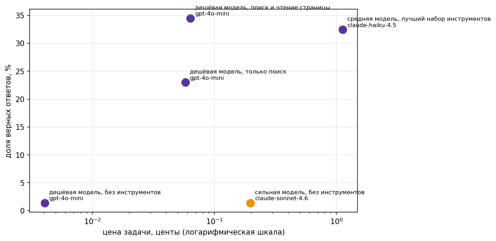
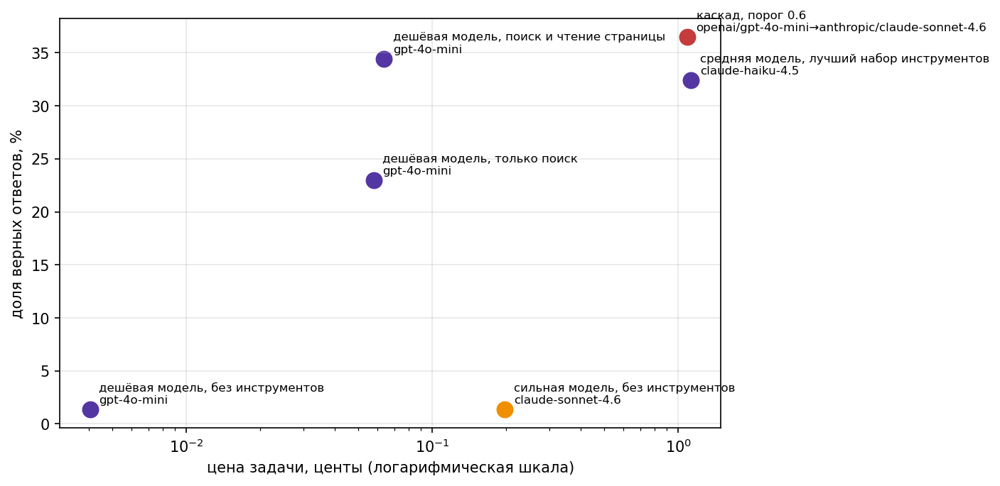

# Свежие вопросы и агент, который на них отвечает

Домашнее задание 1. Агент на дешёвой модели отвечает на вопросы о событиях после 1 января 2025 года том, чего не было в обучающих данных моделей, с помощью инструментов поиска и чтения страниц.

## Датасет

`data/fresh.jsonl`, 148 вопросов:

- **125 вопросов** стартовый набор курса, собран скриптом `fetch_fresh.py` из 60 обзорных статей английской Wikipedia про 2026 год (страны, наука, виды спорта).
- **23 вопроса** (`id` вида `guardian-*`) добавлены самостоятельно скриптом `fetch_guardian.py`. Источник [The Guardian Open Platform](https://open-platform.theguardian.com/) (открытый API, бесплатная регистрация), статьи с 1 января 2025 года по сегодня, темы: искусство (`artanddesign`), спорт (`sport`), технологии (`technology`), рестораны (`food`, обзоры ресторанов). Изначально сгенерировано 25 вопросов, 2 убраны вручную после проверки на смысловые ошибки (перепутанный возраст в одном вопросе, неоднозначный формат ответа в другом) итого 23.


## Проверка свежести

```
python check_fresh.py data/fresh.jsonl --sonnet
```

```
записей: 148, проблем: 0

Sonnet без инструментов: 2 из 148 верно, 1%. Потрачено $0.270
критерий свежести пройден
  fresh-20: In the 2026 FIFA World Cup, what format was used for the knockout stage starting June 28? -> The Round of 32 knockout stage format wa...
  fresh-122: Who ousted Sussan Ley in February 2026 in Australian politics? -> Angus Taylor
```

Формат без проблем, доля верных ответов Sonnet 4.6 без инструментов 1%, что значительно ниже порога в 20%. Критерий свежести пройден с большим запасом.

## Агент

Ноутбук `ai-agent-01hw.ipynb` семинарский ReAct-агент с добавленными инструментами:

| Инструмент | Источник | Что делает |
|---|---|---|
| `web_search` | Wikipedia | ищет статью, возвращает вступление |
| `page_find(title, keywords)` | Wikipedia | читает статью целиком, возвращает строки с ключевыми словами |
| `guardian_search` | The Guardian | ищет статью по теме, возвращает заголовок, описание и ссылку |
| `guardian_read(url, keywords)` | The Guardian | читает статью целиком, возвращает абзацы с ключевыми словами |
| `calculator`, `python_exec` | — | из семинара, для вопросов с числами и датами |


## Замер

5 обязательных конфигураций, весь набор из 148 вопросов:

| Конфигурация | Модель | Доля верных | Цена задачи | Цена верного ответа | Шагов | Секунд |
|---|---|---:|---:|---:|---:|---:|
| дешёвая модель, без инструментов | gpt-4o-mini | 1.4% | $0.00004 | $0.0030 | 1.0 | 2.1 |
| дешёвая модель, только поиск | gpt-4o-mini | 23.0% | $0.00058 | $0.0025 | 4.9 | 12.0 |
| **дешёвая модель, поиск и чтение страницы** | **gpt-4o-mini** | **34.5%** | **$0.00064** | **$0.0018** | 4.9 | 10.6 |
| сильная модель, без инструментов | claude-sonnet-4.6 | 1.4% | $0.00197 | $0.1460 | 1.0 | 3.5 |
| средняя модель, лучший набор инструментов | claude-haiku-4.5 | 32.4% | $0.01126 | $0.0347 | 4.4 | 11.5 |

Суммарно потрачено на весь замер: $2.15.



### Вывод

Тезис курса подтвердился. Лучший агент  **дешёвая модель с поиском и чтением страницы**  оказался одновременно и самым точным (34.5%, выше всех остальных конфигураций), и самым дешёвым в пересчёте на верный ответ ($0.0018). Сильная модель без инструментов, которую агент должен обогнать, справляется почти так же плохо, как дешёвая без инструментов,обе около 1.4%. При этом Sonnet стоит на задачу в 3 раза дороже дешёвого агента с инструментами , а по качеству сильно проигрывает.

Более дорогая модель Haiku с тем же набором инструментов не улучшила результат 32.4% против 34.5% у дешёвой модели с теми же инструментами, при цене за верный ответ почти в 19 раз выше ($0.035 против $0.0018). На этой задаче деньги, потраченные на более сильную модель, не окупились.

## Два разобранных провала

**1. Поиск не нашёл** — `fresh-17` (What was launched by ISRO on September 3, 2026?, ожидался ответ EOS-05). Агент 6 раз переформулировал запрос через `web_search`, но ни одна найденная статья Wikipedia не содержала конкретного названия аппарата, запущенного именно в этот день упоминались только общие списки запусков. Дошёл до `max_steps`, честно ответил, что не нашёл. Трейс: `traces/дешёвая модель, поиск и чтение страницы/gpt-4o-mini/fresh-17.json`.

**2. Ответ верный, но не прошёл проверку** — `fresh-4` (What measure came into force in Victoria, Australia in January 2026?, ожидался ответ "A total fire ban"). Агент через `page_find` нашёл нужный факт про чрезвычайные предупреждения о лесных пожарах в Виктории и ответил по существу верно: `FINAL: Total fire ban due to heatwave and bushfires`. Автоматическая проверка (`is_correct`) не засчитала ответ, потому что нормализованный эталон `"a total fire ban"` (с артиклем) не встречается как точная подстрока в ответе агента, который начинается сразу с "Total fire ban" без "a". Ограничение самой проверки, не агента. Трейс: `traces/дешёвая модель, поиск и чтение страницы/gpt-4o-mini/fresh-4.json`.

## Бонус: второй источник поиска

Чтобы показать, что второй источник The Guardian не просто добавлен для количества, а реально нужен прогнала ещё одну конфигурацию, та же дешёвая модель с поиском и чтением страницы, но **только Wikipedia**, без guardian инструментов, на том же наборе из 148 вопросов.

| Конфигурация | Доля верных | Цена задачи | Цена верного ответа |
|---|---:|---:|---:|
| дешёвая модель, поиск и чтение с Guardian | 34.5% | $0.00064 | $0.0018 |
| дешёвая модель, поиск и чтение только Wikipedia | 23.6% | $0.00069 | $0.0029 |

Разница особенно заметна на 23 вопросах, собранных именно из Guardian :

| | Доля верных на guardian-вопросах |
|---|---:|
| с Guardian-инструментами | 52.2% |
| без них (только Wikipedia) | 4.3% |


Без второго источника агент почти не отвечает на вопросы своего собственного расширения датасета.

## Бонус: каскад поверх агента

Каскад поверх настоящего агента с инструментами работает так: сначала на вопрос отвечает дешёвая модель с полным набором инструментов (`web_search`, `page_find`, `guardian_search`, `guardian_read` тот же набор, что и в лучшей из пяти обязательных конфигураций. Отдельным структурированным запросом  модель сама оценивает уверенность в своём же ответе числом от 0 до 1. Если уверенность ниже порога вопрос заново уходит к сильной модели Sonnet с тем же набором инструментов, и в зачёт идёт уже её ответ.

Порог 0.6, весь датасет из 148 вопросов:

| Конфигурация | Модель | Доля верных | Цена задачи | Цена верного ответа | Эскалировано |
|---|---|---:|---:|---:|---:|
| дешёвая модель, поиск и чтение страницы | gpt-4o-mini | 34.5% | $0.00064 | $0.0018 | — |
| средняя модель, лучший набор инструментов | claude-haiku-4.5 | 32.4% | $0.01126 | $0.0347 | — |
| **каскад (порог 0.6): дешёвая → сильная при неуверенности** | gpt-4o-mini → claude-sonnet-4.6 | **36.5%** | $0.01089 | $0.0298 | 54 из 148 |



### Вывод

Каскад обогнал по точности все пять обязательных конфигураций 36.5% и не за счёт того, что дорогая модель отвечает на все вопросы, а за счёт того, что она подключается только там, где дешёвая модель сама себя оценила как неуверенную. Показательнее всего сравнение со средней моделью Haiku с тем же набором инструментов, которая отвечает на все 148 вопросов без разбора, цена задачи у неё почти такая же, как у каскада , но точность ниже 32.4% , а цена за верный ответ выше. При сопоставимом бюджете каскад более выгодная стратегия, чем просто взять модель подороже на все вопросы.

Ограничение подхода: уверенность, полученная отдельным вызовом,  это самооценка модели, а не гарантия правильности ответа,среди эскалированных и неэскалированных вопросов есть и ложные срабатывания в обе стороны. Порог не подбирался перебором  использовалось одно значение 0.6 из соображений бюджета, к этому моменту леджер за всю сессию составлял $3.86 из ориентировочных $5.

## Структура репозитория

```
data/fresh.jsonl          — датасет, 148 вопросов
ai-agent-01hw.ipynb       — ноутбук с агентом и инструментами
fetch_fresh.py            — сбор стартового набора (курс)
fetch_guardian.py         — сбор дополнительных 23 вопросов из The Guardian
check_fresh.py            — проверка формата и свежести (курс)
traces/                   — трейсы итогового прогона (6 конфигураций × 148 вопросов, включая бонусную)
img/money_quality.png     — график цена/качество, 5 обязательных конфигураций
img/money_quality_bonus.png — график цена/качество, с бонусной точкой (только Wikipedia)
img/money_quality_cascade.png — график цена/качество, с точкой каскада
.env.example              — шаблон переменных окружения (без ключей)
requirements.txt          — зависимости
```

## Как запустить

```
pip install -r requirements.txt
cp .env.example .env   # вписать OPENROUTER_API_KEY и GUARDIAN_API_KEY
python check_fresh.py data/fresh.jsonl --sonnet
jupyter notebook ai-agent-01hw.ipynb
```
