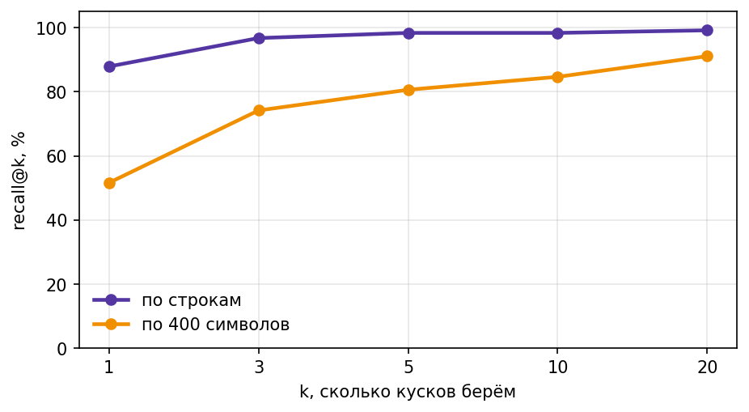
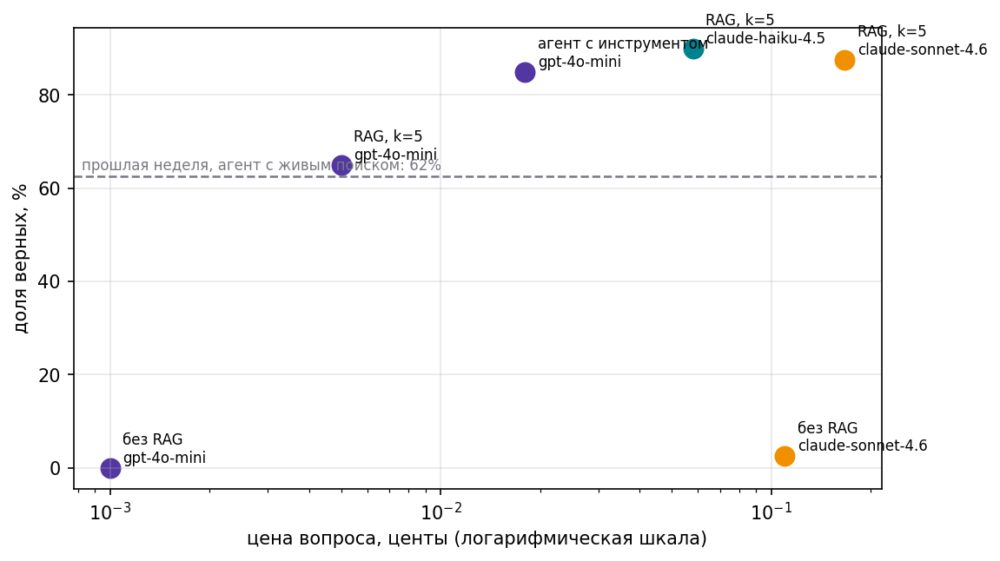
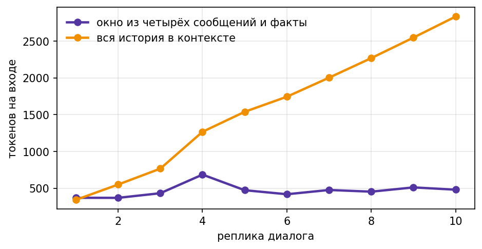

# База знаний и память агента

Домашнее задание 2. Тот же агент из первой домашки получает базу знаний вместо живого поиска и долгую память вместо разговора с чистого листа. Проверяем тезис курса на новом месте: сколько стоит верный ответ, когда дешёвая модель получает пять нужных строк вместо всей страницы.

## Корпус

28 обзорных страниц английской Википедии про 2026 год — те же источники, что в первой домашке (`fetch_corpus.py` из репозитория семинара), 827 482 символа. Вопросы — стартовый набор курса, 124 штуки, у каждого есть `evidence` с цитатой, по которой определяется верный кусок.

Две нарезки:

- **наивная, по 400 символов** — не глядя на границы предложений;
- **по строкам** — каждая страница устроена как список датированных событий («January 2 – Equatorial Guinea moves its capital…»), поэтому одна строка = одно событие = один кусок; название месяца/даты едет с куском как метаданные (`section`).

Наивная нарезка даёт 2077 кусков, построчная — 7835. Построчная нарезка не режет факты пополам: наивная, например, разрывает вопрос про 15 марта (бойкот Украиной церемонии закрытия Паралимпиады) ровно между двумя 400-символьными кусками.

## Индекс и качество поиска

Milvus standalone (embedded etcd, локальное хранилище) — `docker-compose.yml` в репозитории, `docker compose up -d`. Эмбеддинги — `text-embedding-3-small`, урезанные до 512 измерений, с кэшем на диске (`emb_cache.npz`): повторный прогон ноутбука не платит за уже посчитанные тексты.

**recall@k** для обеих нарезок:

| k | по строкам | по 400 символов |
|---|---:|---:|
| 1 | 0.88 | 0.52 |
| 3 | 0.97 | 0.74 |
| 5 | 0.98 | 0.81 |
| 10 | 0.98 | 0.85 |
| 20 | 0.99 | 0.91 |



Разрыв особенно заметен при k=1 (0.88 против 0.52) — построчная нарезка почти всегда находит нужный факт с первой попытки, наивная — только в половине случаев. Выбрала **k=5** для генерации: recall уже почти на плато (0.98), а k=3 даёт ту же точность в итоговой таблице почти вдвое дешевле — компромисс между ценой и запасом на менее удачные вопросы.

Milvus (AUTOINDEX, приближённый поиск) совпадает с полным перебором на 94.5% выдачи и в 100 из 124 вопросов даёт тот же топ-1 результат — ожидаемая плата за скорость на HNSW-подобном индексе. На своём корпусе (7835 векторов) разница в скорости с numpy ещё не критична, но при раздувании до 200 тысяч векторов numpy растёт почти линейно (3.66 → 65.61 мс/запрос), а Milvus пачкой держится почти на месте (0.23 → 1.91 мс/запрос).

## Гибрид: вектор + слова + RRF

| нарезка | поиск | recall@1 | recall@5 |
|---|---|---:|---:|
| по 400 символов | только вектор | 0.52 | 0.81 |
| по 400 символов | только слова | 0.76 | 0.90 |
| по 400 символов | гибрид RRF | 0.73 | 0.90 |
| по строкам | только вектор | 0.88 | 0.98 |
| по строкам | только слова | 0.90 | 0.98 |
| по строкам | гибрид RRF | 0.90 | 0.99 |

Гибрид сильнее всего помогает слабой нарезке (recall@1: 0.52 → 0.73) — там, где вектору тяжело, точный поиск по словам (имена, числа, названия) закрывает пробел. На сильной нарезке прирост скромный (0.88 → 0.90): вектору там и так почти некуда расти.

## Итоговый замер

Пять обязательных конфигураций на 40 вопросах:

| Конфигурация | Модель | Доля верных | Цена вопроса | Цена верного ответа |
|---|---|---:|---:|---:|
| сильная модель, без инструментов | claude-sonnet-4.6 | 2.5% | $0.00110 | $0.04419 |
| дешёвая модель, живой поиск (ДЗ1) | gpt-4o-mini | 62.5% | $0.00064 | $0.00102 |
| дешёвая модель, RAG всегда | gpt-4o-mini | 62.5% | $0.00005 | $0.00008 |
| дешёвая модель, агент с `knowledge_base` | gpt-4o-mini | 87.5% | $0.00019 | $0.00021 |
| средняя модель, RAG всегда | claude-haiku-4.5 | 90.0% | $0.00058 | $0.00065 |



## Таблица отказов

10 вопросов без ответа в корпусе — все 10 честно получили `NOT_FOUND`, ни одного выдуманного ответа. Медиана близости лучшего куска у отвечаемых вопросов — 0.753, у неотвечаемых — 0.614: разрыв достаточный, чтобы порог близости (~0.65–0.7) служил дешёвым сигналом отказа ещё до вызова модели.

## Два разобранных провала

**1. Поиск не нашёл.** [ЗАПОЛНИТЬ: вопрос и gold-ответ из `results` с `found=False`, например id 82/101/103 — текст вопроса из `tasks[<id>]["question"]`]. Разобрать: почему нужного куска не было в топ-5 — нарезка, формулировка вопроса, или сама формулировка события в источнике сильно отличается от вопроса.

**2. Нашёл, но отказался.** Вопрос про соглашение Украины и Румынии (эталон: «a strategic partnership agreement») — с прямым RAG (`RAG, k=5`) дешёвая модель ответила `NOT_FOUND`, хотя нужный кусок был в контексте (`found=True`). Тот же вопрос агент с `knowledge_base` решил верно (ответ: «strategic partnership agreement in defense and energy sectors»), потому что мог переформулировать запрос и посмотреть на источник ещё раз, а не полагаться на один заход. Показывает главную выгоду агентного подхода: не точность самого поиска, а возможность переспросить.

## Память

Эпизодическая память — журнал реплик в файле (`episodes.jsonl`), в контекст не идёт. Семантическая — короткие факты о пользователе, которые дешёвая модель извлекает в конце сессии и хранит в отдельной коллекции Milvus; новый факт заменяет старый, а не ложится рядом.

Две сессии: в первой пользователь (Лена, Новосибирск, продуктовый аналитик, интересуется космосом и хоккеем) рассказывает о себе; во второй, без истории первой сессии в контексте, агент верно вспоминает интересы и честно говорит, что новостей о хоккее нет. После того как пользователь сообщает, что переехала в Калининград и теперь следит за футболом вместо хоккея, факты в памяти **заменяются**, а не задваиваются.

Тесты без обращения к модели (пустая память, найденный факт, заменённый факт) — все три проходят на прямых вызовах `store_facts`/`recall_facts`.

**График токенов** — диалог из 10 реплик, «окно из четырёх сообщений + факты» против «вся история в контексте»:



К 10-й реплике: 4649 токенов у варианта с окном и фактами против 15878 у полной истории (в 3.4 раза меньше), цена — $0.00092 против $0.00193 (в 2.1 раза дешевле). Разница растёт с каждой репликой: полная история растёт линейно, окно+факты держится почти плоско.

## Бонус 1: корпус из PDF

Тот же конвейер на своём корпусе — банк задач части B профильного ЕГЭ по математике из открытого банка (собственные материалы для занятий с учениками), `ege_math_partB.pdf`, 37 страниц → 37 кусков по страницам, метаданные — имя файла и номер страницы. В ответе агент явно ссылается на источник, например `(ege_math_partB.PDF, стр. 1)` на вопрос про этаж квартиры Наташи, или `(ege_math_partB.PDF, стр. 4)` — на вопрос про вероятность жеребьёвки теннисистов.

Один честный отказ по пути: вопрос по графику производной (`sin`/чтение с рисунка) агент не смог решить — `pypdf` вытаскивает из PDF только текст, графики и формулы с дробями и тригонометрией часто превращаются в нечитаемую кашу при извлечении. Модель на это ответила `NOT_FOUND`, а не выдумала цифру — для страниц с картинками и сложной нотацией page-level чанкинга текстом маловато.

## Бонус 2: родительский кусок

Вместо одной найденной строки в контекст генератору отдаётся окно соседних строк той же страницы (±2 строки) — вдруг у самого события не хватает контекста для ответа.

| Конфигурация | Доля верных | Цена вопроса | Цена верного ответа |
|---|---:|---:|---:|
| RAG, k=5, обычный кусок | 65% | $0.00005 | $0.00008 |
| RAG, k=5, родительский кусок | 75% | $0.00014 | $0.00018 |

+10 п.п. точности примерно за втрое большую цену контекста — всё ещё копейки в абсолюте, разменять стоило.

## Вывод по тезису курса

[ЗАПОЛНИТЬ САМОЙ — черновик мысли, поправь по своим словам:] Тезис подтвердился и на этой неделе. Верный ответ подешевел не за счёт более дешёвой модели (она та же, gpt-4o-mini, что и в живом поиске из ДЗ1), а за счёт того, что агенту больше не нужно тратить шаги на блуждание по живой Википедии: цена верного ответа упала с $0.00102 (живой поиск) до $0.00021 (агент с базой знаний) — почти в 5 раз, — а точность выросла с 62.5% до 87.5%. Агент, который сам решает, когда искать (`knowledge_base`), обошёл и постоянный RAG (87.5% против 62.5%), и более дорогую модель с постоянным RAG (обогнал по цене почти в 3 раза при сопоставимой точности с haiku).

## Структура репозитория

```
data/corpus_2026.jsonl     — корпус, 28 страниц Википедии
data/fresh_2026.jsonl      — 124 вопроса с эталонами и цитатами
data/pdf/                  — материалы для PDF-бонуса
ai-agent-02hw.ipynb        — ноутбук со всеми спринтами
fetch_corpus.py            — сбор корпуса (семинар)
docker-compose.yml         — Milvus standalone
embedEtcd.yaml             — конфиг встроенного etcd
emb_cache.npz              — кэш эмбеддингов
img/                       — графики: recall, money_all, memory_tokens
.env.example                — шаблон переменных окружения
requirements.txt           — зависимости
```

## Как запустить

```
pip install -r requirements.txt
cp .env.example .env          # вписать OPENROUTER_API_KEY
docker compose up -d          # поднять Milvus, дождаться healthy
jupyter notebook ai-agent-02hw.ipynb
```
