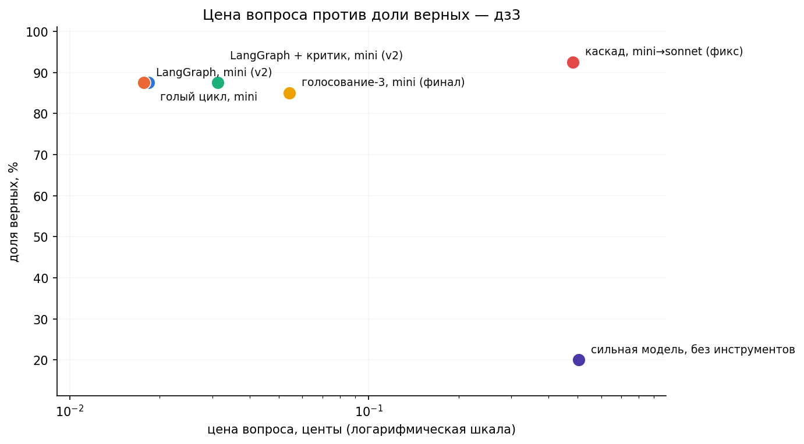

# Фреймворк, критик, голосование: что окупается

Домашнее задание 3. Проверяем, какие технологические трюки с агентом реально окупаются, если честно считать токены и цену, а не просто смотреть на долю верных.

## Агент и корпус

Тот же агент, что и в дз2 — RAG-агент с инструментом `knowledge_base` поверх Milvus (построчная нарезка, 7835 кусков, 28 страниц английской Википедии про 2026 год, k=5). Код инструмента и цикла агента не менялся; добавился только общий httpx-счётчик вызовов, чтобы точно считать токены и цену для каждой конфигурации.

40 вопросов из общего набора курса (`data/fresh_2026.jsonl`).

## Шаг 1-2: голый цикл против LangGraph

| Конфигурация | Доля верных | Вызовов/вопрос | Токенов/вопрос | Цена вопроса |
|---|---:|---:|---:|---:|
| голый цикл, mini | 87.5% | 2.5 | 946 | $0.000177 |
| LangGraph, mini | 90.0% | 2.7 | 1064 | $0.000194 |

Перенос на LangGraph на первый взгляд ничего не сломал: точность не хуже, цена почти та же (+10%). Позже, в разделе «Проверка проверки», выяснилось, что у LangGraph-версии были скрытые `GraphRecursionError` (несколько вопросов из 40) — реальная картина видна в итоговой таблице после честного пересчёта.

### Налог на пустой запрос

Сравнила первый вызов на тривиальном вопросе у голого цикла и у LangGraph:

| | prompt tokens |
|---|---:|
| голый цикл | 170 |
| LangGraph | 160 |

LangGraph оказался даже немного дешевле на старте — не дороже, как в семинаре, а дешевле, потому что его автогенерируемая JSON-схема инструмента компактнее (не добавляет поле `title` к каждому параметру). При этом описания параметров (`query`, `page`) не потерялись: я сразу завернула инструмент через `args_schema=KBArgs` с `Field(description=...)`, а не через автоматический вывод из тайп-хинтов, который в семинаре как раз терял описания.

## Шаг 3: два паттерна недели

### Критик с опорой

Отдельный граф: агент отвечает → модель-судья сверяет ответ с фактами, которые агент реально нашёл через `knowledge_base` → если не подтверждено, агент получает замечание и пробует ещё раз (максимум 2 попытки).

| Конфигурация | Доля верных | Цена вопроса |
|---|---:|---:|
| LangGraph + критик, mini | 87.5% | $0.000313 |

Критик обошёлся почти в 2 раза дороже базовой строки и в честном финальном прогоне не изменил ничего: 0 исправленных, 0 сломанных ответов (при равных долях верных — 87.5% у критика против 87.5% у чистого LangGraph). Деньги потрачены, а эффекта нет.

### Голосование и каскад

Голосование: 3 независимых прогона с температурой 0.7, большинство голосует по нормализованному ответу. Каскад: то же голосование, но при разногласии голосов вопрос эскалируется на сильную модель (claude-sonnet-4.6).

| Конфигурация | Доля верных | Вызовов/вопрос | Цена вопроса |
|---|---:|---:|---:|
| голосование-3, mini | 85.0% | 7.8 | $0.000542 |
| каскад, mini→sonnet | 92.5% | 8.8 | $0.004821 |

Голосование само по себе не дало ничего: точность даже чуть ниже базовой (85% против 87.5%) при цене втрое выше. Каскад — единственная надстройка, которая реально выиграла: +5 п.п. точности, лучший результат из всех конфигураций. Но досталось это дорого: 18 из 40 вопросов ушли на эскалацию, а цена вопроса выросла примерно в 26 раз относительно голого цикла.

## Проверка проверки

Решила проверить саму себя на самом подозрительном результате: первая версия каскада неожиданно оказалась близка или хуже базовой линии — странно для паттерна, который должен подключать более сильную модель именно на сложных вопросах. Руками посмотрела неверные ответы — и это оказался не баг проверки (`is_correct`), а настоящий баг в самом агенте: большинство «неверных» ответов на деле были `GraphRecursionError` (5 из 6 в одном из прогонов) — LangGraph-агент падал с ошибкой при эскалации на сильную модель, не успевая ответить в пределах `recursion_limit=14`.

Это ровно та проблема, что описана в задании: агент упирается в лимит шагов и крашится вместо честного ответа. У меня она пряталась — на обычных вопросах агенту хватало 2-3 шагов, а вопросы с разногласием голосов (куда идёт эскалация) оказались систематически сложнее и чаще требовали больше шагов. Добавила мидлварь `last_step_without_tools` (отбирает инструменты и заставляет ответить после 5 шагов, вместо падения) и пересчитала:

| Конфигурация | До фикса | После фикса |
|---|---:|---:|
| каскад, mini→sonnet | 85.0% ($0.004419/вопрос) | 92.5% ($0.004821/вопрос) |

Без «проверки проверки» вывод был бы куда менее убедительным — а на деле каскад оказался лучшей конфигурацией из всех, просто с багом в реализации. Заодно проверила остальные LangGraph-конфигурации на скрытые `GraphRecursionError`: они были у всех (3 у голого LangGraph, 4 у критика, 6 у голосования), просто не портили итог так заметно, как у каскада, где эскалируются как раз самые спорные вопросы.

## Бюджетный предел

Ограничила агента кодом, а не промптом — `ModelCallLimitMiddleware(run_limit=1, exit_behavior="end")`:

Вопрос: *On what date did Ukraine boycott the closing ceremony of the 2026 Winter Paralympics?*

- без предела: «Ukraine boycotted the closing ceremony of the 2026 Winter Paralympics on 15 March 2026. FINAL: 15 March 2026» (верно);
- с пределом в 1 вызов: «Model call limits exceeded: run limit (1/1)» — мидлварь остановила агента раньше, чем он успел хоть раз заглянуть в базу знаний.

## Итоговая таблица

| Конфигурация | Модель | Доля верных | Вызовов/вопрос | Цена вопроса | Цена верного ответа |
|---|---|---:|---:|---:|---:|
| голый цикл | gpt-4o-mini | 87.5% | 2.6 | $0.000183 | $0.000209 |
| LangGraph | gpt-4o-mini | 87.5% | 2.5 | $0.000177 | $0.000203 |
| LangGraph + критик | gpt-4o-mini | 87.5% | 4.3 | $0.000313 | $0.000358 |
| голосование-3 | gpt-4o-mini | 85.0% | 7.8 | $0.000542 | $0.000638 |
| каскад mini→sonnet | gpt-4o-mini / sonnet-4.6 | 92.5% | 8.8 | $0.004821 | $0.005212 |
| сильная модель одна | claude-sonnet-4.6 | 20.0% | 1.0 | $0.005051 | $0.025255 |



## Вывод

Из всех надстроек реальный выигрыш дал только каскад: +5 п.п. точности (92.5% против 87.5% у голого цикла), но ценой роста стоимости вопроса примерно в 26 раз — больше трети вопросов ушли на сильную модель. Голосование и критик — дорогие украшения: голосование утроило цену и не подняло точность вовсе (85% против 87.5%), а критик удвоил цену и в честном финальном прогоне не изменил ни одного ответа (0 исправлено, 0 сломано). Перенос на фреймворк сам по себе, без паттернов, не стоил ни выигрыша, ни вреда — точность и цена остались на уровне голого цикла.

## Структура репозитория

```
data/fresh_2026.jsonl      — 40 вопросов с эталонами (общий набор курса)
hw3.ipynb                  — ноутбук со всеми шагами
img/money_hw3.png          — итоговая картинка
docker-compose.yaml        — Milvus standalone (тот же контейнер, что в дз2)
embedEtcd.yaml             — конфиг встроенного etcd
emb_cache.npz              — кэш эмбеддингов (общий с дз2)
.env.example                — шаблон переменных окружения
requirements.txt           — зависимости
```

## Как запустить

```
pip install -r requirements.txt
cp .env.example .env          # вписать OPENROUTER_API_KEY
docker start milvus           # если контейнер уже поднят (общий с дз2)
# или docker compose up -d, если контейнера ещё нет
jupyter notebook hw3.ipynb
```

Коллекция `lines` в Milvus должна быть уже проиндексирована (см. дз2) — дз3 не пересобирает индекс, а переиспользует контейнер и данные.
